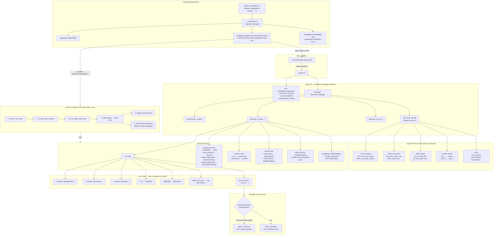

# Issue 3110 — Python Keyword Tokenization

**Date of research:** 2026-02-17

## Bug Description

In the Monaco Editor playground, Python 3.10's `match` and `case` keywords are not
syntax highlighted. When entering code such as:

```python
match command:
    case "quit":
        quit_game()
    case _:
        default_action()
```

`match` and `case` appear as plain identifiers (CSS class `identifier.python`) instead
of receiving the `keyword.python` token class like other keywords (`def`, `class`,
`print`, etc.). This was reported as
[GitHub Issue #3110](https://github.com/microsoft/monaco-editor/issues/3110).

---

## Key Files Identified

| File                                                | Role                                                                                                                                                   |
| --------------------------------------------------- | ------------------------------------------------------------------------------------------------------------------------------------------------------ |
| `src/basic-languages/python/python.ts`              | Monarch language definition — `conf` (LanguageConfiguration) and `language` (IMonarchLanguage) including the `keywords` array and all tokenizer states |
| `src/basic-languages/python/python.contribution.ts` | Language registration — calls `registerLanguage()` with id `'python'` and wires up lazy loading                                                        |
| `src/basic-languages/python/python.test.ts`         | Tokenization tests — uses `testTokenization('python', [...])`                                                                                          |
| `src/basic-languages/test/testRunner.ts`            | Shared test harness — exports `testTokenization()` and `ITestItem` / `IRelaxedToken` interfaces                                                        |

---

## Current Behavior

The `keywords` array in `python.ts` (line 53) is a **single flat list** containing:

- **True language keywords** — `if`, `for`, `class`, `def`, `return`, `while`, `try`,
  `except`, `import`, `async`, `await`, `nonlocal`, `yield`, `lambda`, etc.
- **Built-in functions** — `len`, `print`, `range`, `map`, `filter`, `sorted`, `zip`, etc.
- **Built-in types** — `int`, `str`, `float`, `dict`, `list`, `set`, `tuple`, `bool`, etc.
- **Dunder names** — `__init__`, `__name__`, `__class__`, `__dict__`, etc.
- **Other** — `self`, `property`, `staticmethod`, `classmethod`

All entries receive the same `keyword` token class (via the `'@keywords': 'keyword'`
case guard in the root tokenizer state).

**`match` and `case` are NOT present in the `keywords` array.** This is the direct
cause of the bug.

---

## Python 3.10 Specification Details

- **Release date:** October 4, 2021
- **PEP:** [PEP 634 — Structural Pattern Matching: Specification](https://peps.python.org/pep-0634/)
- **New soft keywords:** `match`, `case`
- **Soft keyword semantics:** `match` and `case` are only treated as keywords
  inside a match/case statement. They remain valid identifiers elsewhere (e.g.
  `match = re.match(...)` is legal). This was intentional to avoid breaking
  existing code.
- `_` has special wildcard meaning inside `case` clauses but is **not** a keyword.

---

## Tokenizer Implementation Options

| Option                               | Approach                                                                                                                                    | Pros                                                                                                   | Cons                                                                                 |
| ------------------------------------ | ------------------------------------------------------------------------------------------------------------------------------------------- | ------------------------------------------------------------------------------------------------------ | ------------------------------------------------------------------------------------ |
| **A. Always highlight**              | Add `match` and `case` to the existing `keywords` array                                                                                     | Simple; immediate fix; consistent with how `print`/`exec` (also context-dependent) are already handled | False positives — `match = re.match(...)` would highlight `match` as a keyword       |
| **B. Context-sensitive rules**       | Add Monarch tokenizer rules that only highlight `match` when followed by `<expr>:` at statement level, and `case` only inside a match block | Accurate; no false positives                                                                           | Complex; Monarch's regex-based engine makes multi-line context tracking difficult    |
| **C. Separate `softkeywords` array** | Create a new array (e.g. `softkeywords`) mapped to a distinct token class (e.g. `keyword.soft`)                                             | Allows themes to style soft keywords differently; acknowledges their dual nature                       | Still has false positives unless combined with context rules; requires theme updates |
| **D. Do nothing**                    | Leave `match`/`case` as identifiers                                                                                                         | No false positives                                                                                     | Users get no highlighting for pattern matching — the reported bug persists           |

**Notes:**

- Option A matches the approach taken by most major syntax highlighters (VS Code
  TextMate grammar, Pygments, tree-sitter, etc.).
- The existing `keywords` array already contains context-dependent entries (`print`
  is a function in Python 3, `exec` is a function in Python 3) that are
  unconditionally highlighted, so Option A is consistent with precedent.

### Deep Dive: Context-Sensitive Regex (Option B)

Could we add regex rules with lookahead in the `root` state to get context-sensitive
matching _without_ complicated Monarch state tracking?

**Technique:** Monarch evaluates rules top-to-bottom, so a more specific rule placed
_before_ the generic `[a-zA-Z_]\w*` catch-all would take priority. We can use
lookahead assertions to peek at what follows `match`/`case`:

```typescript
// Insert before the generic identifier rule in root:
[/match(?=\s+\w+.*:\s*$)/, 'keyword'],
[/case(?=\s+[\w"'\[({_].*:\s*$)/, 'keyword'],
```

The idea: `match` is only highlighted when followed by whitespace + an expression +
`:` at end of line. Same for `case`.

**What it gets right:**

| Pattern                 | Highlighted?         | Correct? |
| ----------------------- | -------------------- | -------- |
| `match command:`        | Yes                  | Yes      |
| `case "quit":`          | Yes                  | Yes      |
| `case _:`               | Yes                  | Yes      |
| `match = re.match(...)` | No (no trailing `:`) | Yes      |
| `match.group(0)`        | No (`.` not `\s`)    | Yes      |
| `case = get_case()`     | No                   | Yes      |

**Where it breaks down:**

Monarch processes tokens left-to-right and **cannot look behind** — by the time
the regex matches `match`, any preceding tokens on the line (like `for`) have
already been consumed. This creates false positives:

| Pattern                 | Highlighted?            | Correct?                            |
| ----------------------- | ----------------------- | ----------------------------------- |
| `for match in matches:` | **Yes** — ends with `:` | **No** — `match` is a loop variable |
| `if match:`             | **Yes** — ends with `:` | **No** — `match` is a condition     |
| `while case:`           | **Yes** — ends with `:` | **No** — `case` is a condition      |

Fixing these would require Monarch state tracking (e.g., push a state after
`for`/`if`/`while` to suppress matching), which is exactly the complexity this
approach tries to avoid.

**Side-by-side comparison with Option A:**

| Scenario                | Regex lookahead (B)   | Always highlight (A)  |
| ----------------------- | --------------------- | --------------------- |
| `match command:`        | keyword               | keyword               |
| `match = re.match(...)` | identifier ✓          | **keyword** (false +) |
| `for match in matches:` | **keyword** (false +) | **keyword** (false +) |
| `if match:`             | **keyword** (false +) | **keyword** (false +) |
| `print(match)`          | identifier ✓          | **keyword** (false +) |
| Implementation effort   | Moderate              | Trivial               |

**Conclusion:** The regex approach trades one set of false positives for a smaller
(but arguably less predictable) set. It correctly handles the most common
false-positive cases (assignment, attribute access, function arguments) but still
fails on any line ending with `:`. Option A is wrong more often but is
**predictably** wrong — and is consistent with how `print`/`exec` are already
handled in this file. Neither approach achieves full correctness without Monarch
state tracking.

---

## Decision

> **Chosen option:** _<!-- TODO: fill in chosen option letter (A/B/C/D) -->_
>
> **Reasoning:** _<!-- TODO: explain why this option was selected -->_
>
> **Additional notes:** _<!-- TODO: any caveats, follow-up work, or scope limitations -->_

---

## Suspected Root Cause

The `keywords` array in `src/basic-languages/python/python.ts` was last updated
for Python 3.5-era keywords (`async`, `await`, `nonlocal`). The comment at the top
of the array says the list was generated by running `keyword.kwlist` in a Python
REPL, but it was never re-run against Python 3.10+. Since `match` and `case` are
soft keywords, they do **not** appear in `keyword.kwlist` — they appear in
`keyword.softkwlist` (added in Python 3.10). This means even re-running the
documented command would not catch them without also checking `softkwlist`.

---

## Test Patterns

| Detail                | Value                                                                                                       |
| --------------------- | ----------------------------------------------------------------------------------------------------------- |
| **Test file**         | `src/basic-languages/python/python.test.ts`                                                                 |
| **Helper**            | `testTokenization(languageId, tests)` from `src/basic-languages/test/testRunner.ts`                         |
| **Token type format** | `<tokenClass>.<tokenPostfix>` — e.g. `keyword.python`, `identifier.python`, `string.python`                 |
| **Interfaces**        | `ITestItem { line: string; tokens: IRelaxedToken[] }`, `IRelaxedToken { startIndex: number; type: string }` |

### Example test for `match`/`case`

```typescript
// match/case as keywords (Python 3.10 structural pattern matching)
[
    {
        line: 'match command:',
        tokens: [
            { startIndex: 0, type: 'keyword.python' },
            { startIndex: 5, type: 'white.python' },
            { startIndex: 6, type: 'identifier.python' },
            { startIndex: 13, type: 'delimiter.python' }
        ]
    }
],

[
    {
        line: '    case "quit":',
        tokens: [
            { startIndex: 0, type: 'white.python' },
            { startIndex: 4, type: 'keyword.python' },
            { startIndex: 8, type: 'white.python' },
            { startIndex: 9, type: 'string.escape.python' },
            { startIndex: 10, type: 'string.python' },
            { startIndex: 14, type: 'string.escape.python' },
            { startIndex: 15, type: 'delimiter.python' }
        ]
    }
],
```

---

## Open Questions

1. _<!-- TODO: Should `_`(wildcard pattern) receive special highlighting inside`case` clauses, or is it fine as a regular identifier? -->\_
2. _<!-- TODO: Are there other Python 3.10+ soft keywords or builtins missing from
   the keywords array beyond `match` and `case`? (e.g. `type` from Python 3.12
   PEP 695) -->_
3. _<!-- TODO: Should this fix also sub-classify the keywords array into
   `keywords`, `builtins`, `typeKeywords`, etc. for richer highlighting, or is
   that out of scope for this issue? -->_
4. _<!-- TODO: Do any existing tests need to be updated if `match`/`case` are
   added? (Currently no tests reference `match` or `case`.) -->_

---

## Architecture



### Key Observations

1. **Single token class for all keywords**: The Python `keywords` array mixes true language keywords (`if`, `def`, `class`), built-in functions (`len`, `print`, `range`), built-in types (`int`, `str`, `dict`), dunder names (`__init__`), and `self` into one flat list. All receive the same `keyword` token class.

2. **Monarch `cases` guard**: When the root-state regex `/[a-zA-Z_]\w*/` matches an identifier, the `cases` construct checks it against the `keywords` array using an efficient hash-map lookup. There are only two outcomes: `keyword` or `identifier`.

3. **No sub-classification**: Other Monaco languages (e.g., Java, C#, TypeScript) split words into separate arrays (`keywords`, `typeKeywords`, `builtins`, etc.) and assign distinct token classes (`keyword`, `keyword.type`, `predefined`, etc.), enabling different syntax highlighting colors. Python does not do this.

4. **tokenPostfix**: The `.python` suffix is appended to all token classes, so the final CSS classes are `keyword.python`, `identifier.python`, `comment.python`, etc.
